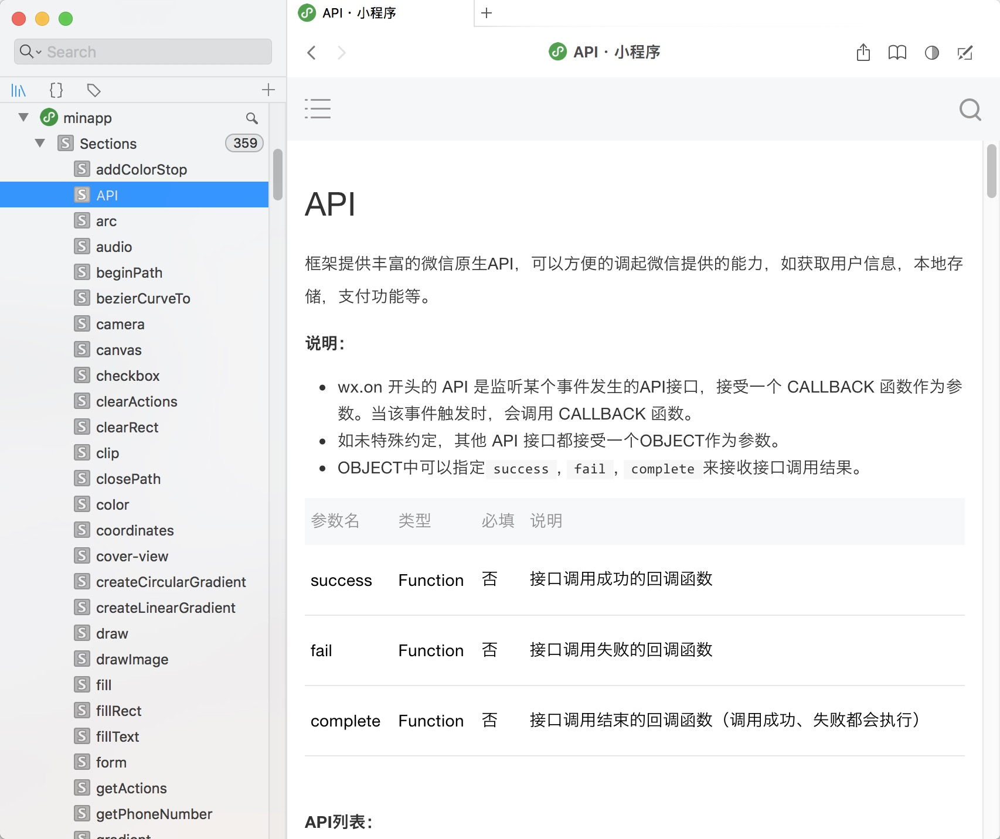
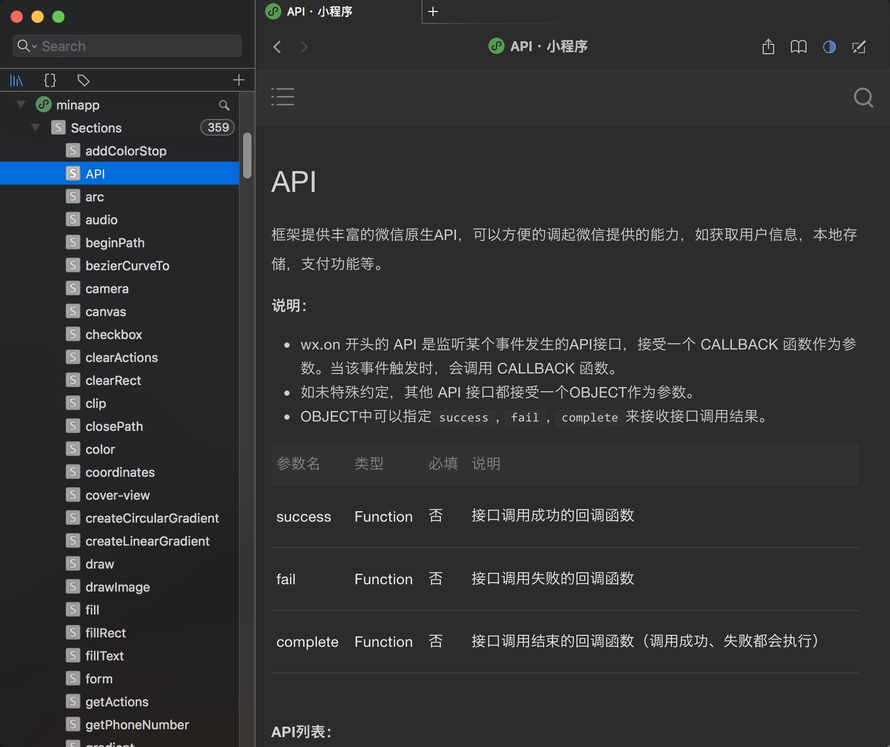
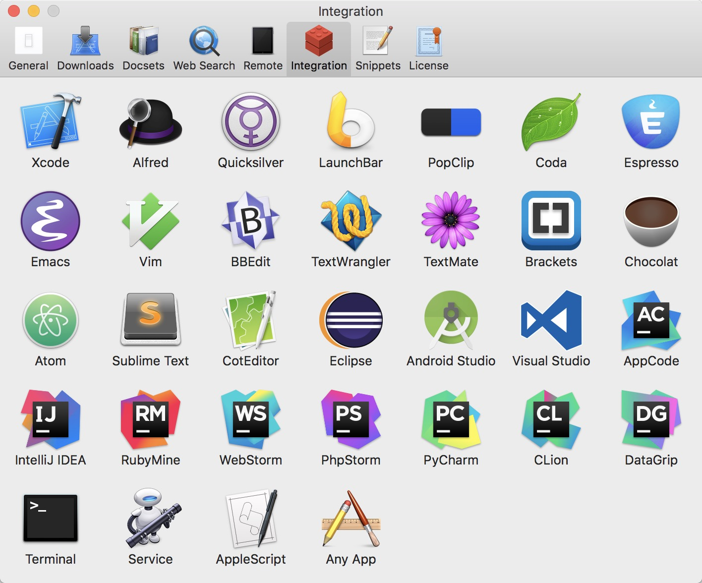

# 微信小程序离线文档

微信小程序官方文档的离线版，Docset格式，可添加到下列软件中使用：

*Mac:* [Dash](https://kapeli.com/dash)

*Windows:* [Velocity](http://velocity.silverlakesoftware.com)

*Linux:* [Zeal](https://zealdocs.org/)

## 效果如下

安装Dash插件后（Velocity/Zeal），可从Webstorm等IDE中快速查询文档

